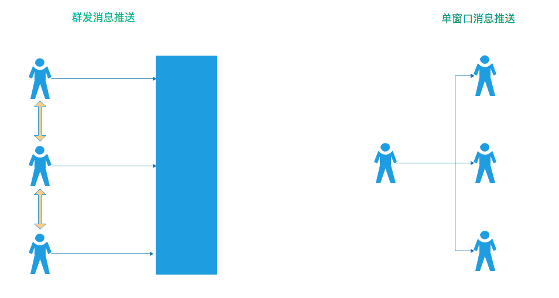
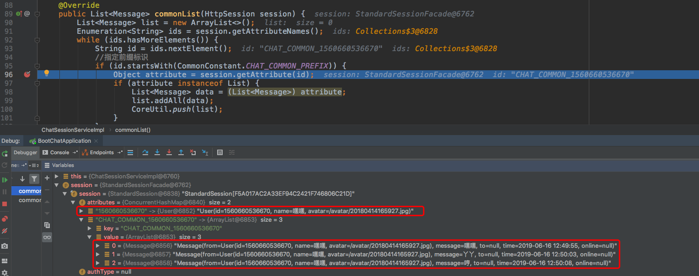
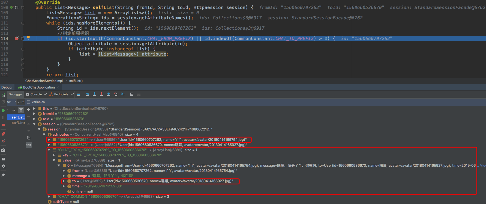
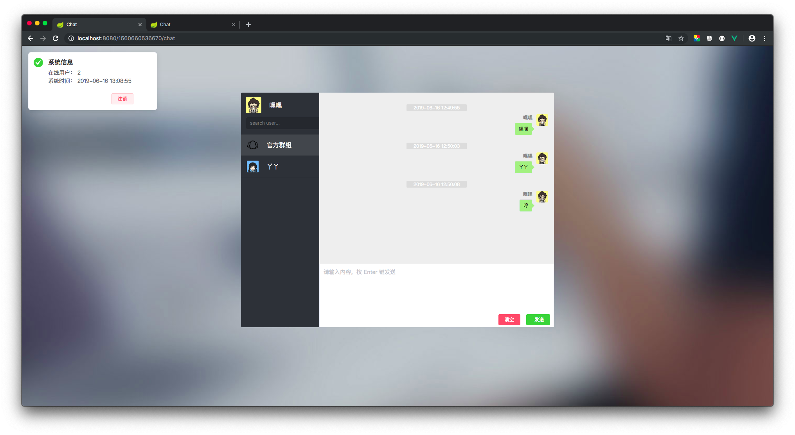
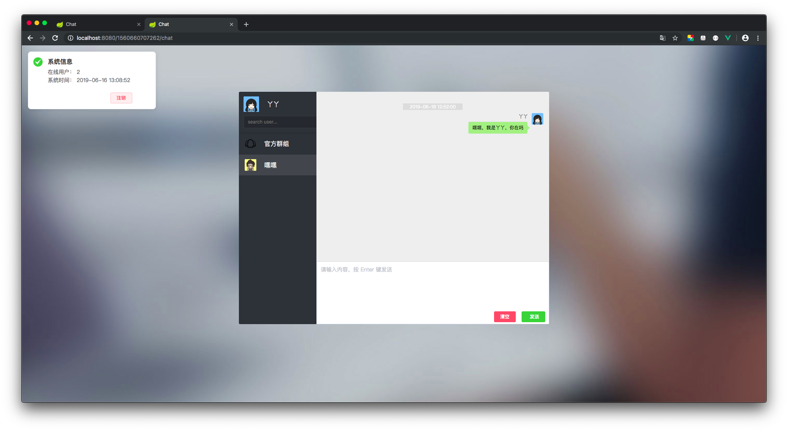

# 基于WebSocket的在线聊天系统

 <p align="center">
  <a href="https://github.com/TyCoding/boot-chat/" target="_blank">
    
  </a>
  
  
  
 </p>
 
**线上地址**

[Chat](http://39.105.46.235:8087/)

**注意！注意！注意！**

当前版本中，使用HTTPSession储存的WebSocket会话消息（包括登录用户信息），因此就不可避免的会遇到Session不能被共享导致的数据丢失。

因此，在我部署的线上地址上可能出现数据丢失。如果是测试学习，请使用同一个浏览器换用不同用户登录，这不会产生上述问题了。

SO，后续我会使用Redis储存WebSocket的会话消息（当前版本的优点就是开箱即用，只需要JDK环境即可运行项目打包jar）。

正在开发中，欢迎star、fork关注哦~~

## 介绍

基于SpringBoot-2.1.5、SpringBoot-Starter-Websocket构建，前端使用Vue.js、ElementUI框架。

实现了：

* HttpSession消息储存
* 单窗口消息推送
* 群发消息推送
* 上线提醒
* 实时刷新用户列表、消息列表

找 *虫子* 无聊之余，可以来耍一耍！

## 特点

因为WebSocket的特性，虽然能实时接收到消息，但每次刷新浏览器，之前发送过的消息都会丢失，因此这里实现了消息储存功能。

利用HttpSession，将每次会话，用户推送的消息都储存到HttpSession中。前端利用Vue的 `created()` 钩子函数，每次刷新页面时都先请求获取HTTPSession中已储存的消息列表。

因为涉及到单窗口推送消息、群发消息的限定：



这里规定了HttpSession中会话消息的前缀标识，以此来区分不同的消息，具体参看：[CommonConstant.java](https://github.com/TyCoding/boot-chat/blob/master/src/main/java/cn/tycoding/constant/CommonConstant.java)

* `CHAT_COMMON_PREFIX = "CHAT_COMMON_"`: 群发消息Session Key前缀标识

* `CHAT_FROM_PREFIX = "CHAT_FROM_"`: 推送方Session Key前缀标识

* `CHAT_TO_PREFIX = "_TO_"`: 接收方Session Key前缀标识

## 核心依赖

| 依赖 | 版本 |
| --- | --- |
| Spring Boot | 2.1.5.RELEASE |
| spring-boot-starter-websocket | 2.1.5.RELEASE |
| lombok | 1.18.8 |
| spring-boot-starter-thymeleaf | 2.1.5.RELEASE |
| FastJSON | 1.2.58 |
| Vue.js | 2.6.10 |
| Element-UI | 2.7.0 |

## 文档

看了上图你大概知道了HTTPSession中储存的消息格式，下面Debug看下具体的消息内容，供大家学习参考：

### 群发消息

这里使用一个固定的*官方群组*窗口，展示每个用户群发的消息。

消息特点：

* 多个用户发送
* 每个用户发送多条消息

So，HTTPSession中储存的群发消息应该有以下约定：

* Session Key 中包含用户的ID标识
* Session Value 应该储存着该Key用户的所有消息（可使用List集合储存）

栗子：



### 单窗口消息推送

对于给指定窗口消息，需要考虑以下几点：

* 推送方是谁？接收方是谁？
* 推送方可能会推送多条消息，并且推送方可能会给多个窗口推送消息。
* 如何区分是公共消息还是指定窗口消息？

So，HTTPSession中储存的但窗口消息应该有以下约定：

* Session Key 应该包含推送方ID标识和接收方ID标识，以此区分给多个窗口推送
* Session Value 应该储存着该推送方给该接受方推送的所有消息（List集合）

栗子：



## 运行&&部署

```
# 运行

$ git clone https://github.com/TyCoding/boot-chat
-- use idea & eclipse run

# 部署

$ mvn clean package
$ cd taget
$ java -jar boot-chat-0.0.1-SNAPSHOT.jar
```

Access http://localhost:8080 using Chrome

## 请喝果汁

如果此项目对你的学习有些帮助，你或许可以请作者喝一杯果汁以表示鼓励


## 关于我

[传送门](https://www.tycoding.cn/about/)


## 预览




